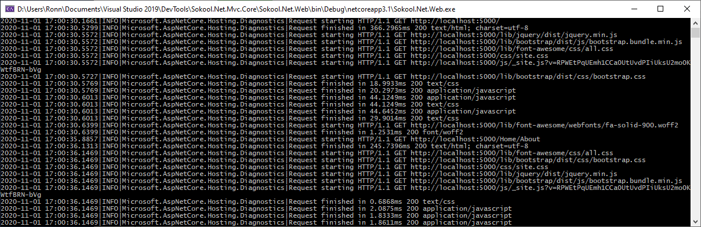
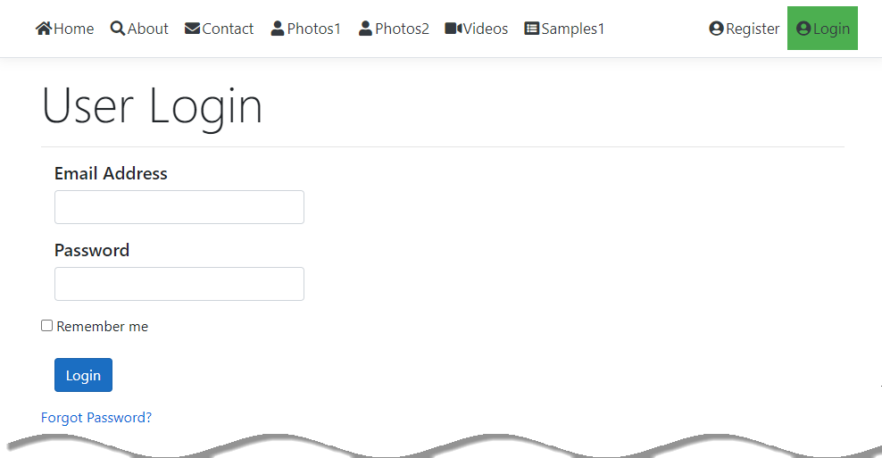
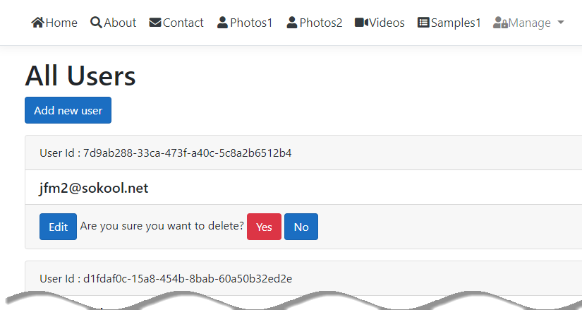
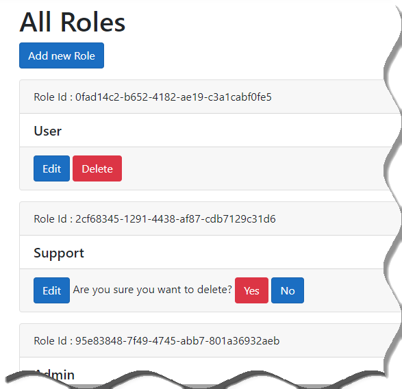

<link href="markdown.css" rel="stylesheet"/>

# Sokool.Net.Mvc.Core
Sokool.Net Website (ASP.NET MVC Core)

This "responsive" web site serves as a home to SokoolTools and is used primarily by its author to <i><b>showcase</b></i> (or more importantly, to <i><b>experiment</b></i> with) the latest Microsoft .NET web technologies.

The site has been finely crafted using the following resources: Microsoft ASP.NET MVC Core 3.l, Razor, HTML5, CSS3, BootStrap, Popper, Font-Awesome, jQuery, jQuery-UI, and more...

The data displayed in both the <b>Photos1</b> view and <b>Photos2</b> view,	as well as the <b>Videos</b> view is generated 'dynamically' by the ASP.Net server by reading all assets placed into the designated web folders using high speed parallel processing.

The <b>Photos2</b> view provides a user friendly interface using a Bootstrap photo carousel/slide show.

The specific <b>Videos</b> view utilizes a jQuery-UI <i>draggable</i>, <i>non-modal</i> dialog to display the corresponding lyrics since this is not otherwise possible using BootStrap.

It also uses a separate BootStrap Tab control for categorizing the videos. Some javascript code was added to correctly activate the current nav tab and the tab corresponding to the current MVC View.

The "<b>Microsoft Visual Studio Debug Console</b>" window opened by Kestrel when debugging:

The "<b>Index</b>" (a.k.a. "<b>Home</b>") page:

The "<b>About</b>" page:

The "<b>Contact</b>" page:

The "<b>User Login</b>" page:

The "<b>Photos1</b> (<i>with <b>Default</b> tab selected</i>)" page:

The "<b>Photos1</b> (<i>with selected photo super-imposed</i>)" page:

")

The "<b>Photos2</b> (<i>with <b>Default</b> tab selected</i>)" page:

The "<b>Photos2</b>" (<i>with items shown in a carousel</i>) page:

The "<b>Videos</b>" page (with the "<b><i>Across the Universe</i></b>" tab selected):

")

The "<b>Videos</b>" page (with the "<b><i>Cartoons</i></b>" tab selected):

")

The "<b>Samples</b>" page:

The "<b>Error 400</b>" page:

The "<b>Error 401</b>" page:

The "<b>Error 403</b>" page:

The "<b>Error 404</b>" page:

The "<b>Error 405</b>" page:

The "<b>Error 406</b>" page:

The "<b>Error 408</b>" page:

The "<b>Error 503</b>" page:

The "<b>Error Internal</b>" page:

The "<b>Play</b> selected video" page:

The "<b>Play</b> selected video (<i>with lyrics dialog shown</i>)" page:

The "<b>All Users</b>" page:

The "<b>User Registration</b>" page:

The "<b>All Users</b> (<i>with embeded delete confirmation</i>)" page:

The "<b>Edit User</b>" page:

The "<b>Manage User Roles</b>" page:

The "<b>Manage User Claims</b>" page:

The "<b>All Roles</b>" page:

The "<b>Edit Role</b>" page:

The "<b>Create Role</b>" page:

The "<b>List Roles</b> (<i>with embedded delete confirmation</i>)" page:

The "<b>Change Password</b>" page:

