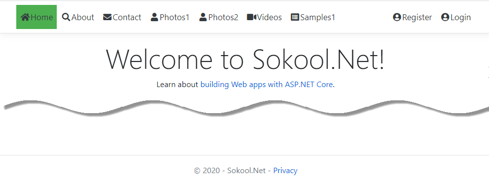
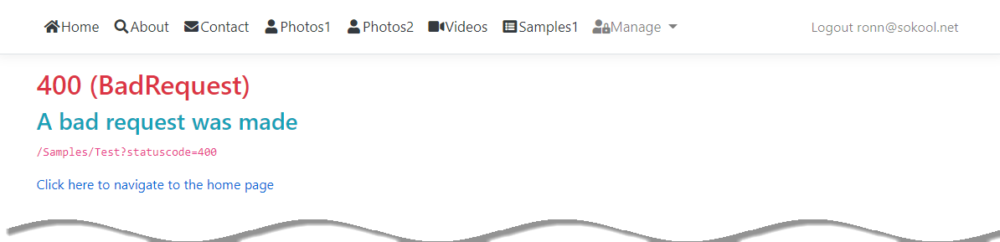
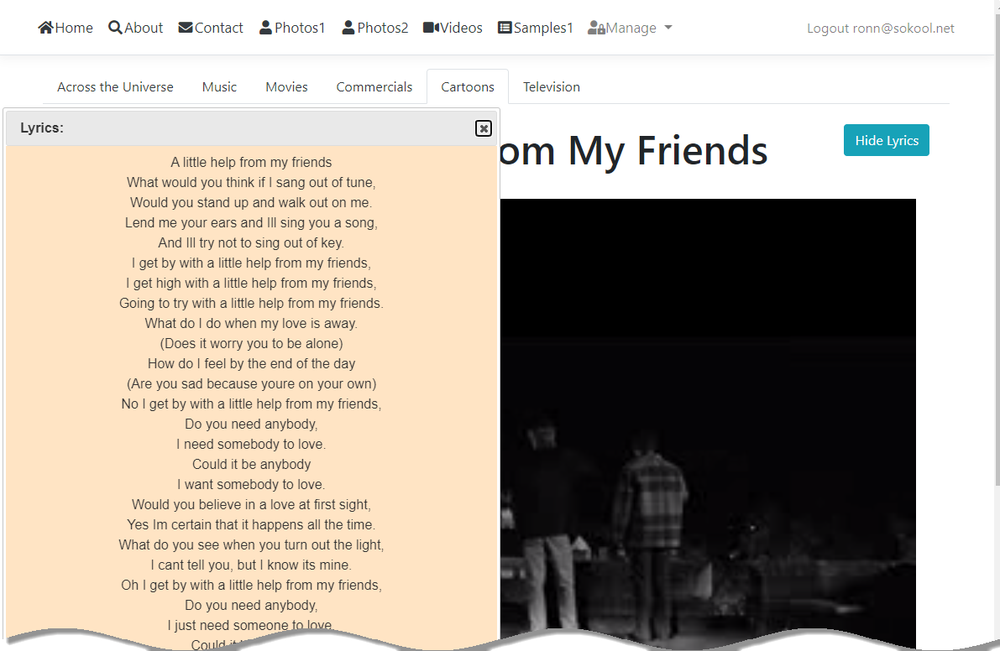
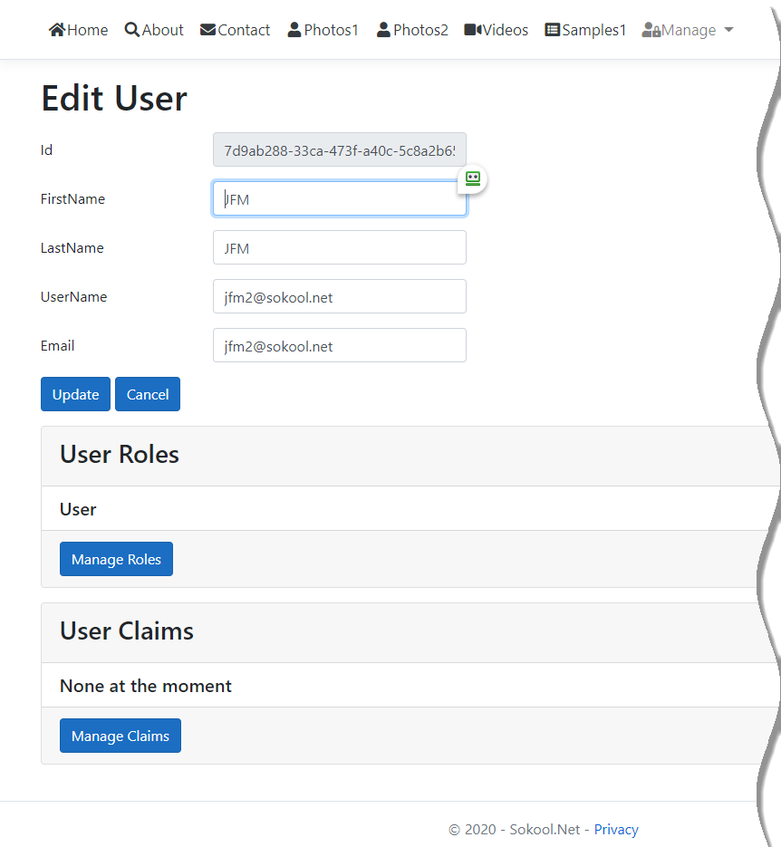
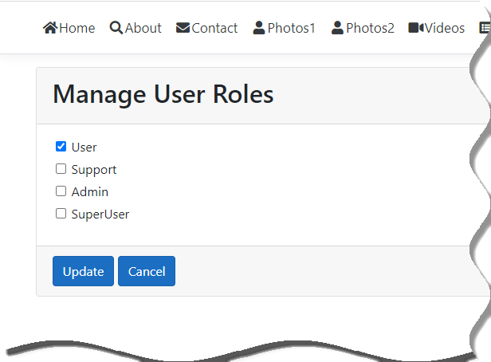
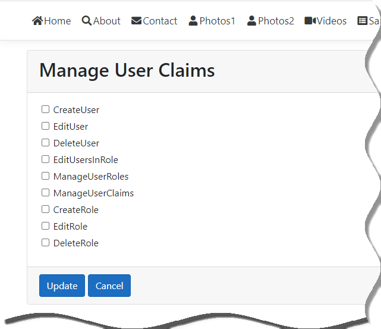
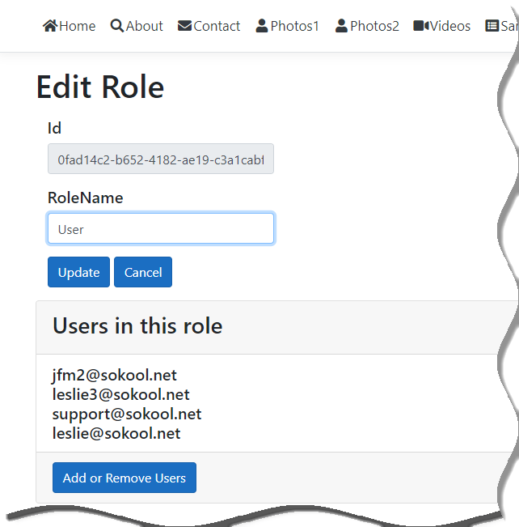
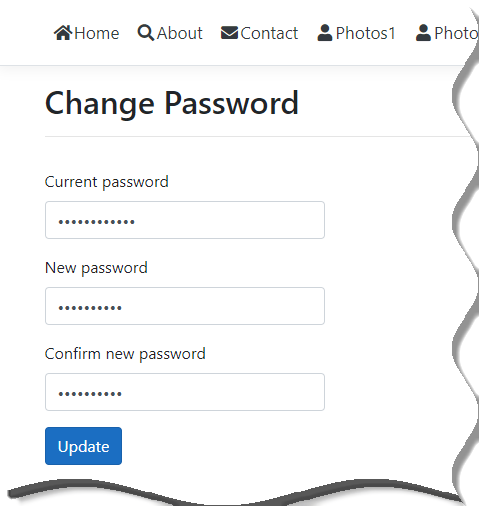

<link href="markdown.css" rel="stylesheet"/>

# Sokool.Net.Mvc.Core
Sokool.Net Website (ASP.NET MVC Core)

This "responsive" web site serves as a home to SokoolTools and is used primarily by its author to <i><b>showcase</b></i> (or more importantly, to <i><b>experiment</b></i> with) the latest Microsoft .NET web technologies.

The site has been finely crafted using the following resources: Microsoft ASP.NET MVC Core 3.l, Razor, HTML5, CSS3, BootStrap, Popper, Font-Awesome, jQuery, jQuery-UI, and more...

The data displayed in both the <b>Photos1</b> view and <b>Photos2</b> view,	as well as the <b>Videos</b> view is generated 'dynamically' by the ASP.Net server by reading all assets placed into the designated web folders using high speed parallel processing.

The <b>Photos2</b> view provides a user friendly interface using a Bootstrap photo carousel/slide show.

The specific <b>Videos</b> view utilizes a jQuery-UI <i>draggable</i>, <i>non-modal</i> dialog to display the corresponding lyrics since this is not otherwise possible using BootStrap.

It also uses a separate BootStrap Tab control for categorizing the videos. Some javascript code was added to correctly activate the current nav tab and the tab corresponding to the current MVC View.

This is the "<b>Microsoft Visual Studio Debug Console</b>" window opened by Kestrel when debugging:

This is the "<b>Index</b>" (a.k.a. "<b>Home</b>") page:

This is the "<b>About</b>" page:

This is the "<b>Contact</b>" page:

This is the "<b>User Login</b>" page:

This is the "<b>Photos1</b>" page:

This is the "<b>Photos1</b>" page:

")

This is the "<b>Photos2</b>" page (Default tab selected):

This is the "<b>Photos2</b>" page (shown as part of a carousel):

This is the "<b>Videos</b>" page (with the "<i>Across the Universe</i>" tab selected:

")

This is the "<b>Videos</b>" page (with the "<i>Cartoons</i>" tab selected):

")

This is the "<b>Samples</b>" page:

This is the "<b>Error</b>" page:

This is the "<b>Error</b>" page:

This is the "<b>Error</b>" page:

This is the "<b>Play Video</b>" page:

This is the "<b>Play Video (w/lyrics)</b>" page:

This is the "<b>All Users</b>" page:

This is the "<b>User Registration</b>" page:

This is the "<b>All Users (Delete)</b>" page:

This is the "<b>Edit User</b>" page:

This is the "<b>Manage User Roles</b>" page:

This is the "<b>Manage User Claims</b>" page:

This is the "<b>All Roles</b>" page:

This is the "<b>Edit Role</b>" page:

This is the "<b>Create Role</b>" page:

This is the "<b>List Roles (Delete)</b>" page:

This is the "<b>Change Password</b>" page:

